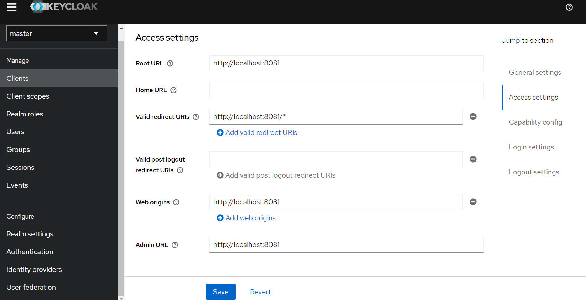

Приложение для работы с задачами 
Инструкция для локального запуска:
1. Dev инфраструктура в составе keycloak и postgres поднимается через docker-compose.yml файл.
2. Приложение можно запустить прямо из idea.
3. Для доступа к Swagger UI перейдите по ссылке: http://localhost:8081/swagger-ui/index.html
4. Для каждого запроса вы должны быть авторизованы, для авторизации в Swagger нажмите кнопку "Authorize" и вставьте JWT токен.
5. Для получения JWT токена выполните следующий запрос:
```
curl --location 'http://localhost:8080/realms/master/protocol/openid-connect/token' \
--header 'Content-Type: application/x-www-form-urlencoded' \
--data-urlencode 'client_id=task' \
--data-urlencode 'client_secret=p8fNA8fHWdL04Wbw2Is3EffjYvH27asE' \
--data-urlencode 'grant_type=password' \
--data-urlencode 'username=user1' \
--data-urlencode 'password=123'
```
6. Для создания пользователя можно зайти в админ панель keycloak по ссылке: http://localhost:8080/admin/master/console/#/master дефолтные креды (admin,admin),
далее нужно перейти во вкладку Users и нажать Add user, после заполнения необходимых полей - Create user, после создания пользователя перейти во вкладку Credentials и устанавливаем пароль(не забудьте поставить Temporary в off).
7. Если нужно обеспечить вход через email: во вкладке Realm settings, вкладка Login - Login with email.
8. Также в Keycloak нужно создать клиента для приложения: вкладка Clients - Create client с такими параметрами:
.
